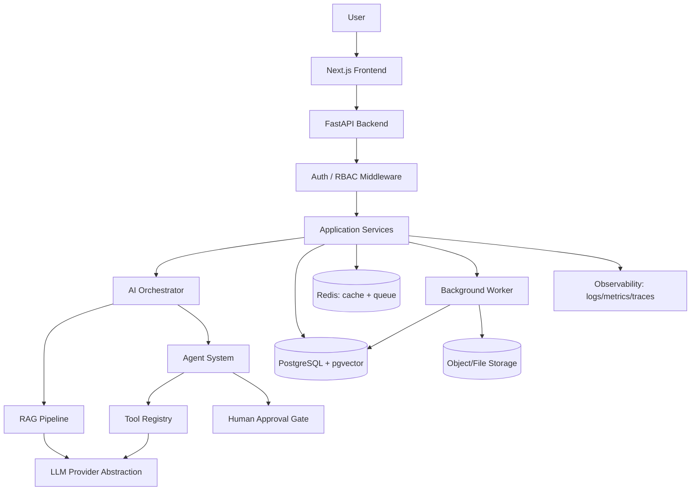
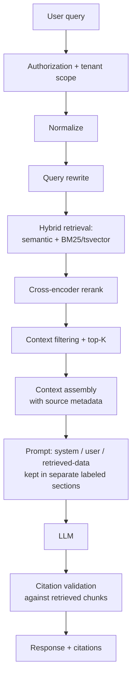
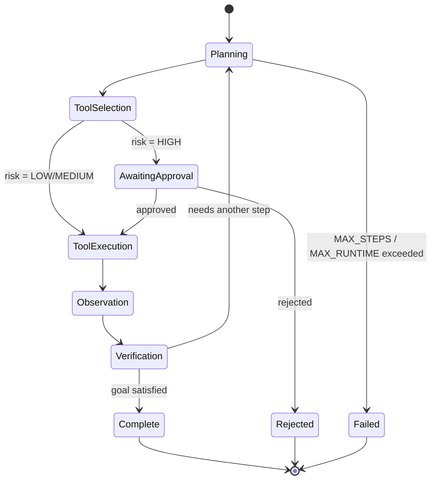

# System Architecture Overview

## 1. High-level flow



## 2. Document ingestion pipeline (async, off the request path)

```mermaid
flowchart LR
    UP[Upload] --> VAL[Validation:\nsize/type/MIME]
    VAL --> SAFE[Safety check]
    SAFE --> QUEUE[(Redis queue)]
    QUEUE --> WORK[Worker]
    WORK --> EXTRACT[Text extraction]
    EXTRACT --> OCR{Scanned?}
    OCR -->|yes| TESS[Tesseract OCR]
    OCR -->|no| CLEAN[Clean text]
    TESS --> CLEAN
    CLEAN --> STRUCT[Structure detection]
    STRUCT --> CHUNK[Chunking]
    CHUNK --> META[Metadata enrichment]
    META --> EMBED[Embedding]
    EMBED --> INDEX[(pgvector + tsvector index)]
    INDEX --> READY[status = COMPLETED]
```


Status transitions: `PENDING → PROCESSING → COMPLETED | FAILED`, with failure reason stored.

## 3. RAG pipeline


`HybridScore = alpha * semantic_score + beta * lexical_score`, alpha/beta configurable per
tenant/collection. Reranker operates on top-N candidates before final top-K context assembly.

## 4. Agent execution


Every transition is persisted (`agent_runs`, `agent_steps`, `tool_calls`, `approvals`) so a
run is fully inspectable and can recover from a crash by resuming from last committed state.

## 5. Database schema (initial — Phase 3 will produce actual Alembic migrations)

Core tables (see CLAUDE.md §3 for tenant-scoping rule):

```
organizations, users, memberships, roles, permissions
collections, documents, document_versions, document_chunks
conversations, messages, citations
agent_runs, agent_steps, tool_calls, approvals
evaluation_runs, evaluation_results
model_usage, audit_logs
```

Every tenant-owned table carries `organization_id` (FK, indexed, NOT NULL) and repository
methods filter on it unconditionally — see ADR-006.

## 6. API surface (v1)

```
/api/v1/auth            register, login, logout, refresh
/api/v1/users           user CRUD (scoped to org, RBAC-gated)
/api/v1/organizations   org settings, membership management
/api/v1/documents       upload, list, get, delete, status
/api/v1/collections     folder/collection CRUD
/api/v1/search          hybrid search endpoint
/api/v1/chat            RAG-backed chat (streaming)
/api/v1/conversations   history, deletion, search, feedback
/api/v1/agents          start/inspect/approve/reject agent runs
/api/v1/tools           tool registry (admin-visible), permissions
/api/v1/evaluations     trigger + inspect evaluation runs
/api/v1/analytics       usage, cost, latency, error rate dashboards
```

Every route: Pydantic request/response schema, RBAC dependency, tenant-scope dependency,
rate limit where relevant (auth, upload, chat, agent execution).

## 7. What's deferred to later phases (intentionally, not forgotten)

- Exact worker library (arq vs Celery) — decided in Phase 3 based on what integrates
  cleanest with the async FastAPI stack without adding unnecessary operational weight.
- Frontend testing framework — decided in Phase 12.
- OpenTelemetry exporter target (local vs hosted) — decided in Phase 11, kept optional
  so local dev doesn't require a running collector.
